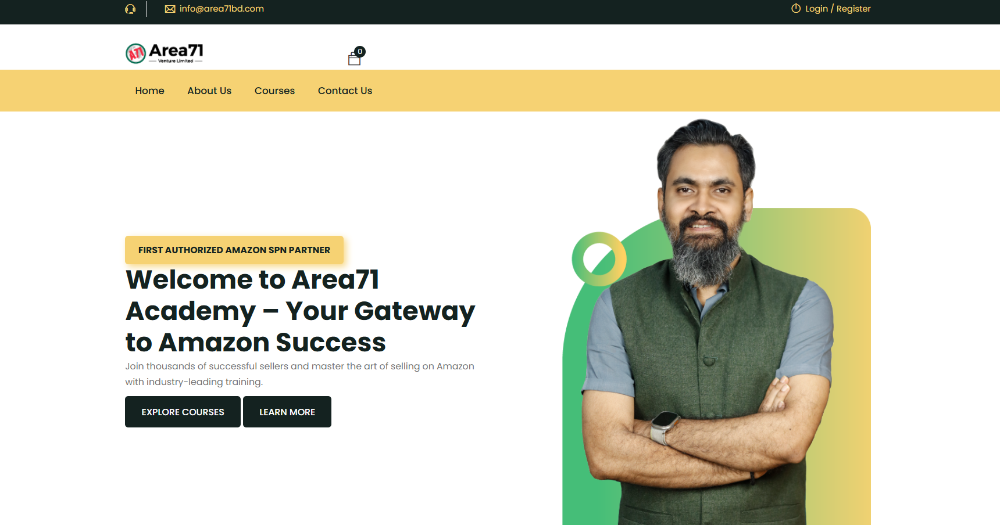
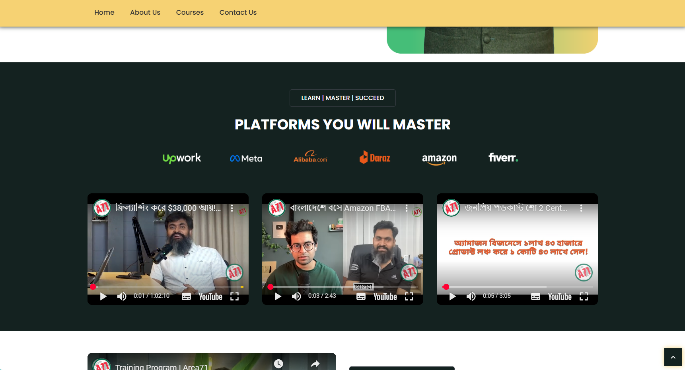

# 📚 Area71 Academy – Laravel Training Platform (Localhost Build)

This is the **localhost build** of the **Area71 Academy Training Platform**, a Laravel-based web application for managing and delivering online training programs such as **Amazon FBA Mastery**, **Supply Chain**, and more.

---

## 🔧 Features

- ⚡ Built with **Laravel 10 Framework**
- 🔑 Authentication (Login/Register)
- 📊 Admin & User Dashboards
- 🛒 Course Purchase and Enrollment System
- 💳 SSLCOMMERZ Payment Gateway Integration
- 📦 Orders and Order Details Management
- 🎨 Responsive Frontend with Blade Templating
- 📑 DataTables for Admin Panel Data Display
- 🏗️ Modular MVC Architecture

---

## 🚀 Installation Steps

1. Clone or download this project.
2. Run the following commands:

composer install
cp .env.example .env
php artisan key:generate
php artisan migrate --seed
php artisan storage:link
php artisan serve

Access the app 👉 [http://127.0.0.1:8000](http://127.0.0.1:8000)

---

## 🧰 Tech Stack

- Backend: Laravel 10, PHP 8.1+
- Database: MySQL
- Frontend: Blade Templating, Bootstrap/Tailwind
- Payment: SSLCOMMERZ Gateway
- Others: DataTables, MVC Pattern

---
## 📸 Screenshots

---

## 🎬 Demo Video

👉 Watch the demo right here 👇

[Demo Video](screenshots/2025-08-23-00-10-58.mp4)

_GitHub supports inline playback for .mp4 files_

---

## 📂 Project Structure (Key)

app/
database/
public/
resources/
routes/
storage/
docs/
├─ screenshots/
├─ course-images/
└─ demo/

---

## 🧪 Database Seeding

Run the following command to seed initial data:

php artisan migrate --seed

text

Custom seeders are inside `database/seeders`.

---

## 🗺️ Roadmap

- Full course → order → dashboard flow
- Student purchase history UI
- Stripe/SSLCOMMERZ sandbox toggle in .env
- Enrollment reports for admin

---

## 📄 License

This project is open-source under the MIT license.
